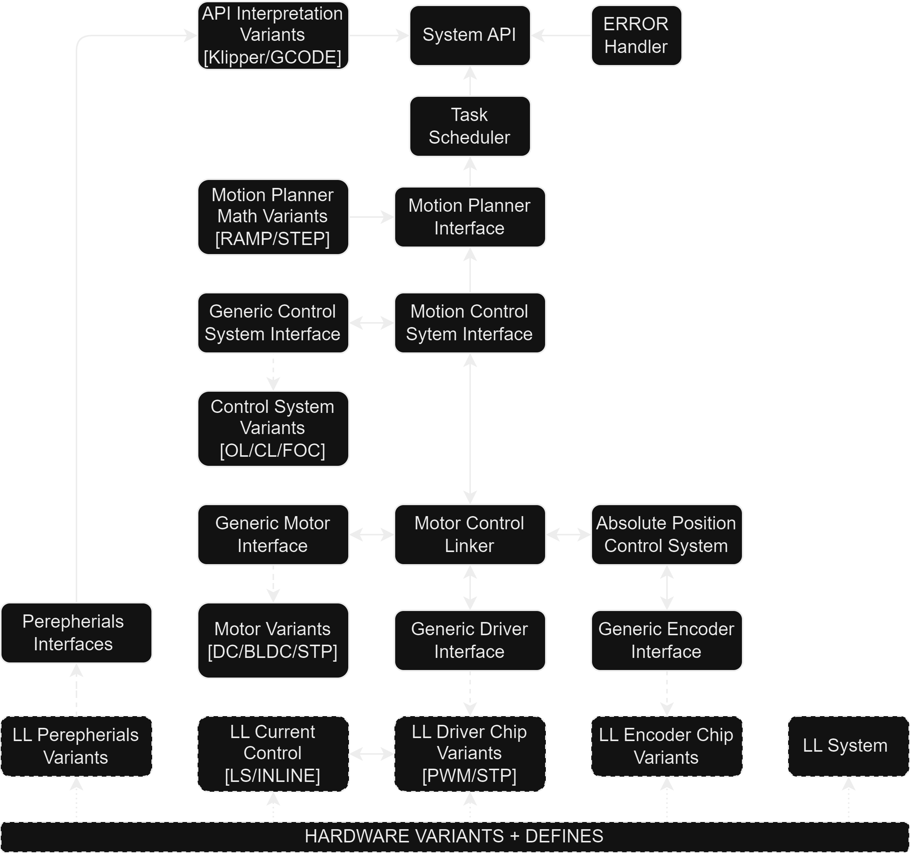

# TunePulse Firmware
[](https://github.com/creapunk/TunePulse/blob/main/LICENSE) 
[](https://platformio.org/)
[](https://discord.gg/V4aJdTja8v)
[](https://ko-fi.com/creapunk)


**TunePulse** is an upcoming open-source firmware designed to
- control a wide range of motors (`DC`, `STEPPERS`, `BLDC`, `PMSM`, `LINEAR`) 
- across various control modes (`CLOSED-LOOP`, `FOC`, `POSITION`, `SPEED`, `TORQUE`, etc.)
- featuring compatibility with multiple interfaces (`STEP-DIR`, `UART`, `I2C`, `CAN/CAN-FD`, `USB`) 
- and support for various protocols (`GCODE`, `KLIPPER`, etc.). 

Its primary goal is to advance the development of closed-loop systems and simplify their integration into existing systems. 

> **Note: This firmware is under heavy development and currently has no documentation.
For more information, join the creapunk community [Discord](https://discord.gg/V4aJdTja8v).**

## STRUCTURE



## SETUP

> The documentation will be updated

### Target defines

For specific targets:

```c
#define TARGET_CLN17_V1_5 # CLN17 v1.5
#define TARGET_CLN17_V2 # CLN17 v2
```

For specific features:

```c
// #define FEATURE_CANFD # CAN FD communication
```
